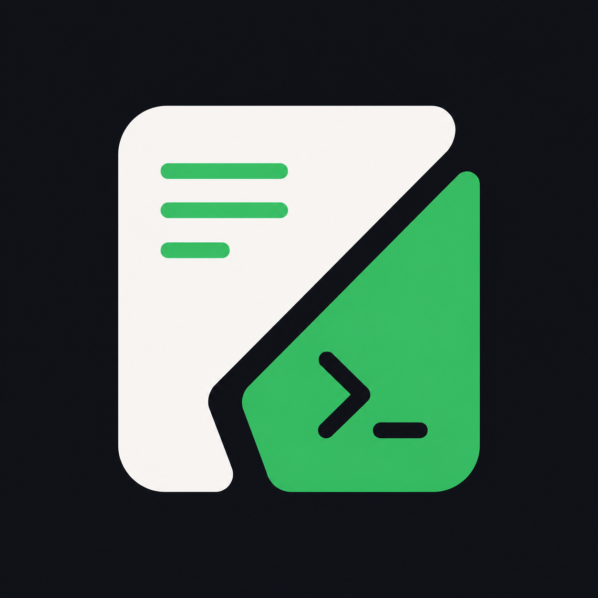

<p align="center">
  
</p>

<h1 align="center">KVIM</h1>

<p align="center">
  IDE modular sobre <strong>Neovim + Lua</strong>, pensado para ofrecer una base moderna,
  extensible y utilizable desde el primer arranque.
</p>

<p align="center">
  UI cuidada · LSP · Telescope · Neo-tree · Yazi · Workspaces · Git · SVN · Connections
</p>

---

## ¿Qué es KVIM?

KVIM es una distribución/configuración modular de Neovim construida alrededor de un core pequeño y módulos funcionales independientes.

La idea no es “tener mil cosas por defecto”, sino ofrecer una base clara para:

- editar con una UI moderna;
- navegar rápido por archivos, buffers y búsquedas;
- trabajar con LSP y autocompletado;
- abrir flujos de Git, SVN y conexiones remotas desde el editor;
- extender el sistema mediante módulos propios.

> Estado real actual: KVIM ya es usable y tiene testing automatizado, pero sigue evolucionando y algunas partes todavía están en consolidación.

---

## Propuesta de valor

### Para usuario final
- **Arranque rápido con Neovim moderno**, sin montar todo desde cero.
- **Experiencia visual cuidada** con tema, barra de estado, explorador y dashboard.
- **Módulos prácticos** para workspaces, Git, SVN y conexiones SSH/serie.
- **Instaladores para Linux y Windows** dentro del propio repo.
- **Personalización local** sin tocar los defaults del proyecto.

### Para quien quiera profundizar
- **Arquitectura modular real**, no solo carpetas decorativas.
- **Comandos, acciones y keymaps** desacoplados por módulo.
- **Integración con `lazy.nvim`** y specs separadas por áreas.
- **Suite de tests headless** con `plenary.nvim` + `busted`.

---

## Características destacadas

### Base de editor y UI
- Tema **Catppuccin**
- **Lualine**
- **Neo-tree**
- **Yazi**
- **Telescope**
- **Treesitter**
- Folds con **nvim-ufo**
- Dashboard con **snacks.nvim**

### Desarrollo
- LSP con:
  - `lua_ls`
  - `clangd`
  - `pyright`
  - `ts_ls`
  - `bashls`
  - `jsonls`
  - `yamlls`
- Gestión de servidores con **mason.nvim**
- Autocompletado con **blink.cmp**

### Módulos actuales
- **workspaces**: guardar/cargar workspaces y restaurar terminales reproducibles
- **git**: integración con LazyGit
- **svn**: `svn info`, `svn status` y LazySVN
- **connections**: SSH, serie, claves SSH, transferencia SCP y comando remoto

---

## Vista rápida

### Screenshots / placeholders

> Actualmente el repositorio incluye logo, pero no una galería formal de screenshots en el README.

Bloques visuales recomendables para futuras capturas:

- dashboard inicial
- layout con Neo-tree + Telescope + Lualine
- módulo Workspaces
- picker/conexión SSH del módulo Connections

---

## Instalación rápida

> KVIM vive dentro de la carpeta `nvim/` del repositorio y está pensado para ejecutarse con `NVIM_APPNAME=kvim` o mediante los launchers que generan los instaladores.

### Requisitos mínimos
- **Neovim >= 0.10.0**
- **Git**

### Dependencias recomendadas según uso
- `ripgrep` → búsquedas con Telescope
- `yazi` → gestor de archivos
- `lazygit` → módulo Git
- `svn` y `lazysvn` → módulo SVN
- `ssh`, `scp`, `ssh-keygen`, `ssh-copy-id` o `ssh` → módulo Connections
- `picocom` → conexiones serie
- `neovide` → modo GUI opcional

---

### Linux

#### Instalación rápida
```bash
git clone https://github.com/kodvmv/kvim.git
cd kvim
bash package/linux/install.sh --yes
kvim
```

#### Activar módulos extra durante la instalación
Por defecto, el instalador Linux parte con **workspaces habilitado** y **git/svn/connections deshabilitados** salvo que se indiquen.

```bash
bash package/linux/install.sh --yes \
  --enable-git \
  --enable-svn \
  --enable-connections
```

#### Notas reales del instalador Linux
- copia la configuración a `~/.config/kvim`
- genera `~/.config/kvim/lua/kvim/local.lua`
- crea launcher `~/.local/bin/kvim`
- soporta `kvim --gui` con fallback a terminal si `neovide` no está disponible
- instala y configura fuentes para la integración prevista
- en **Arch Linux** puede instalar dependencias opcionales soportadas, incluido `neovide`

Si quieres evitar la instalación automática de dependencias opcionales en Arch:
```bash
bash package/linux/install.sh --yes --skip-optional-deps
```

---

### Windows

#### Instalación rápida
```powershell
git clone https://github.com/kodvmv/kvim.git
cd kvim
powershell -ExecutionPolicy Bypass -File package\windows\install.ps1 --yes
kvim
```

#### Activar módulos extra durante la instalación
```powershell
powershell -ExecutionPolicy Bypass -File package\windows\install.ps1 --yes --enable-git --enable-svn --enable-connections
```

#### Notas reales del instalador Windows
- usa **PowerShell**
- intenta garantizar:
  - `nvim >= 0.10.0`
  - `node`
  - `npm`
- verifica `git`
- detecta `neovide` como opcional e intenta instalarlo si falta
- copia la configuración a `%LOCALAPPDATA%\kvim`
- genera `local.lua`
- crea `kvim.bat`
- añade `%LOCALAPPDATA%\kvim\bin` al `PATH` de usuario
- crea acceso directo en el menú inicio
- configura integración básica con fuente y Windows Terminal

> Si `winget` instala dependencias pero no quedan disponibles en la sesión actual, puede ser necesario abrir una terminal nueva y relanzar el instalador.

---

## Primer arranque

Lanzadores soportados:

```bash
kvim
kvim --gui
kvim file.lua
kvim --gui file.lua
```

En Windows y Linux, `kvim --gui` intenta usar `neovide` y, si no está disponible o falla al arrancar, hace fallback a terminal con `nvim`.

Diagnóstico recomendado tras instalar:

```vim
:checkhealth kvim
```

---

## Personalización rápida

KVIM soporta overrides locales en:

```text
~/.config/kvim/lua/kvim/local.lua
```

Precedencia real:
1. defaults de `kvim.config`
2. `kvim.local`
3. opciones pasadas a `require("kvim").setup(...)`

Ejemplo mínimo para activar/desactivar módulos:

```lua
return {
    modules = {
        workspaces = { enabled = true },
        git = { enabled = true },
        svn = { enabled = false },
        connections = { enabled = false },
    },
}
```

---

## Comandos principales

### Core
- `:KvimModules` → lista módulos registrados
- `:KvimAction <modulo> <accion>` → ejecuta una acción registrada

### Workspaces
- `:KvimWorkspaceCreate <name>`
- `:KvimWorkspaceSave [name]`
- `:KvimWorkspaceLoad <name>`
- `:KvimWorkspaceList`
- `:KvimWorkspaceDelete <name>`
- `:KvimWorkspaceCurrent`
- `:KvimWorkspaceNext`
- `:KvimWorkspacePrev`
- `:KvimWorkspaceTerminalAdd`
- `:KvimWorkspaceTerminalList`
- `:KvimWorkspaceTerminalRemove <name>`
- `:KvimWorkspaceTerminalRestore`

### Git
- `:KvimGit`
- `:KvimGitFile`
- `:KvimGitConfig`

### SVN
- `:KvimLazySvn`
- `:KvimSvnInfo`
- `:KvimSvnStatus`

### Connections
- `:KvimConnections`
- `:KvimSshConnections`
- `:KvimSerialConnections`
- `:KvimConnectionsReload`
- `:KvimConnectionsReconnect <name>`
- `:KvimConnectionsList`
- `:KvimConnectionsAdd`
- `:KvimConnectionsDel [name]`
- `:KvimConnectionsGenerateKey`
- `:KvimConnectionsInstallKey`
- `:KvimConnectionsSetupSshKey`
- `:KvimConnectionsTestSsh`
- `:KvimConnectionSetActive`
- `:KvimSSHConnectionSetActive`
- `:KvimConnectionShowActive`
- `:KvimConnectionClearActive`
- `:KvimSSHRun [comando]`
- `:KvimSSHUploadCurrent`
- `:KvimSSHUploadPath [ruta_local]`
- `:KvimSSHDownloadPath [ruta_remota]`

---

## Módulos principales

| Módulo | Estado | Qué hace |
|---|---|---|
| `workspaces` | usable / MVP ampliado | guarda y restaura workspaces, tabs lógicas y recetas de terminal |
| `git` | usable | integra LazyGit para repo y archivo actual |
| `svn` | usable | abre LazySVN y ejecuta `svn info/status` en terminal flotante |
| `connections` | usable | SSH, serie, conexión activa, SCP, gestión de claves y reconexión |

### Sobre `workspaces`
Es uno de los puntos más diferenciales del estado actual de KVIM:
- guarda workspace actual;
- persiste sesión;
- separa tabs lógicas `code` y `term`;
- intenta restaurar terminales reproducibles;
- puede integrarse con `connections` para recetas SSH.

### Sobre `connections`
Es el módulo más orientado a entorno real:
- define conexiones en `~/.config/kvim/connections.lua`
- soporta SSH y serie
- permite subir/bajar archivos
- permite ejecutar comandos remotos
- mantiene conexión activa en memoria de sesión

---

## Keymaps destacados

### Globales
- `s` → guardar
- `qq` → cerrar buffer/ventana
- `qe` → salir
- `<Esc>` → limpiar búsqueda

### Navegación / UI
- `<leader>e` → Neo-tree toggle
- `<leader>E` → Neo-tree focus
- `<leader>ff` → Telescope find files
- `<leader>fg` → Telescope live grep
- `<leader>fb` → Telescope buffers
- `<leader>fr` → archivos recientes
- `<leader>y` → Yazi

### Terminal
- `<C-t>h` / `<C-t>j` / `<C-t>k` / `<C-t>l` → abrir terminal por posición
- `<C-x>` en terminal → volver a modo normal

### Workspaces
- `<leader>ws` → guardar workspace
- `<leader>wl` → listar workspaces
- `<leader>wn` / `<leader>wp` → siguiente / anterior
- `<leader>1` → tab `code`
- `<leader>2` → tab `term`

### Git
- `<leader>g` → LazyGit
- `<leader>f` → LazyGit del archivo actual

### SVN
- `<leader>sv` → LazySVN
- `<leader>si` → SVN info
- `<leader>ss` → SVN status

### Connections
- `<leader>cc` → picker general
- `<leader>cs` → picker SSH
- `<leader>cu` → picker serie
- `<leader>cr` → recargar config
- `<leader>cl` → listar conexiones
- `<leader>ca` → añadir conexión
- `<leader>cd` → borrar conexión

---

## Estado del proyecto

### Qué está sólido ya
- arquitectura modular sobre Lua
- bootstrap con `lazy.nvim`
- UI base y navegación moderna
- LSP y autocompletado
- módulos `workspaces`, `git`, `svn` y `connections`
- instaladores Linux/Windows
- testing automatizado en headless

### Qué conviene saber hoy
- KVIM está **activo**, pero no completamente cerrado a nivel de APIs internas
- parte de la experiencia está más madura en Linux/terminal
- el README intenta ser fiel al estado real: todavía hay piezas en consolidación

### Limitaciones visibles actuales
- en `core/keymaps.lua` existen mappings hacia `KvimRun`, `KvimTest`, `KvimBuild`, `KvimFormat` y `KvimLint`, pero **esos comandos no están definidos actualmente en `core/commands.lua`**
- el módulo Git expone `:KvimGitConfig`, pero **no tiene keymap dedicado** en su implementación actual
- no hay aún una galería oficial de screenshots en el repo

---

## Arquitectura resumida

```text
nvim/
├── init.lua
└── lua/kvim/
    ├── init.lua
    ├── config.lua
    ├── health.lua
    ├── core/
    ├── modules/
    │   ├── workspaces/
    │   ├── git/
    │   ├── svn/
    │   └── connections/
    ├── plugins/
    └── ui/
```

### Flujo real de carga
1. `nvim/init.lua` bootstrappea `lazy.nvim`
2. importa plugins base y plugins de módulos
3. ejecuta `require("kvim").setup()`
4. KVIM:
   - carga configuración global
   - registra comandos core
   - configura UI y tema
   - configura LSP
   - carga módulos habilitados
   - registra acciones
   - aplica keymaps globales

---

## Testing

KVIM incluye suite automatizada con:
- **Neovim headless**
- **plenary.nvim**
- **busted**

### Comando recomendado
```bash
./scripts/test.sh
```

### Comando alternativo directo
```bash
nvim --headless -u tests/minimal_init.lua -c "PlenaryBustedDirectory tests" -c "qa!"
```

Actualmente hay cobertura sobre:
- core
- health
- connections
- workspaces

---

## Estructura de documentación útil

Si quieres profundizar:

- `CHANGELOG.md`
- `AGENTS.md`
- `nvim/lua/kvim/plugins/README.md`
- `nvim/lua/kvim/modules/workspaces/README.md`
- `nvim/lua/kvim/modules/git/README.md`
- `nvim/lua/kvim/modules/svn/README.md`
- `nvim/lua/kvim/modules/connections/README.md`
- `docs/specs/0001-linux-installer.md`
- `docs/specs/0002-windows-installer.md`

---

## Contribuir

Las contribuciones son bienvenidas, especialmente en:
- documentación de usuario
- screenshots reales
- endurecimiento de módulos
- mejoras de keymaps y DX
- cobertura de tests
- pulido de instaladores

### Flujo recomendado
1. revisa el estado real del módulo afectado
2. evita documentar features no implementadas
3. si cambias comportamiento público, actualiza README o README del módulo
4. ejecuta la suite de tests antes de proponer cambios

---

## TL;DR

KVIM ya ofrece una base atractiva para usar Neovim como IDE modular, con una mezcla interesante de:

- **UI moderna**
- **módulos prácticos**
- **integración remota**
- **testing**
- **arquitectura extensible**

Si buscas una base seria sobre Neovim que no sea solo “otra config”, KVIM ya tiene personalidad propia y un camino técnico claro.

---
