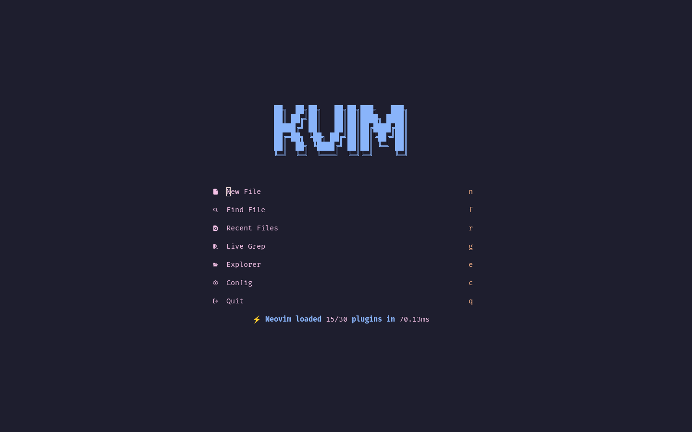
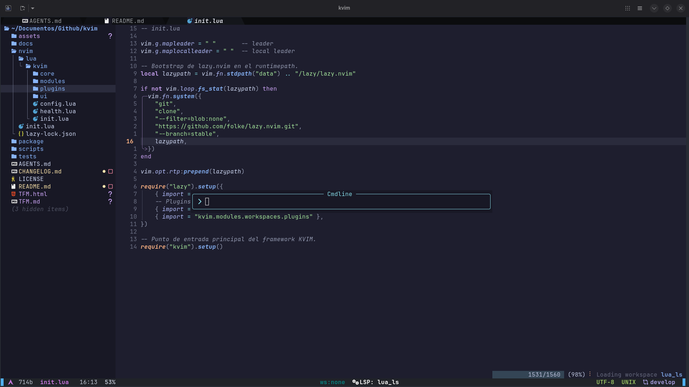
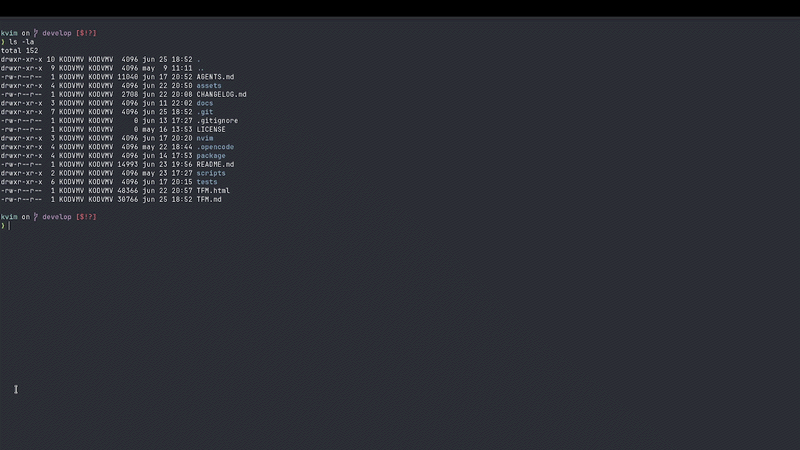
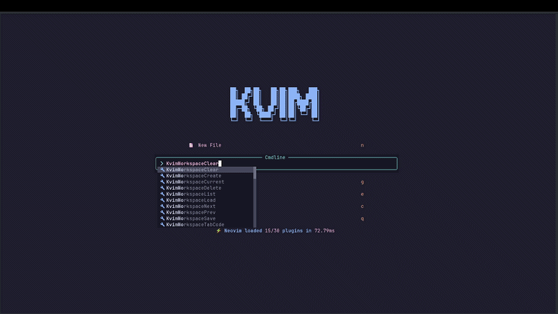
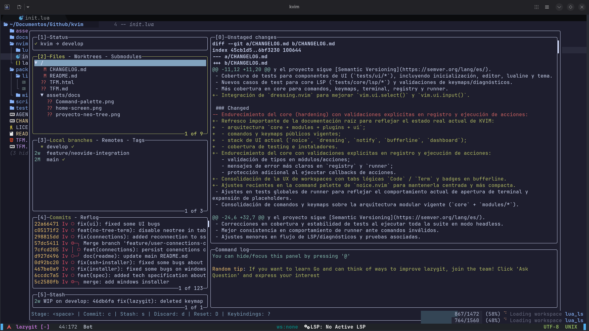
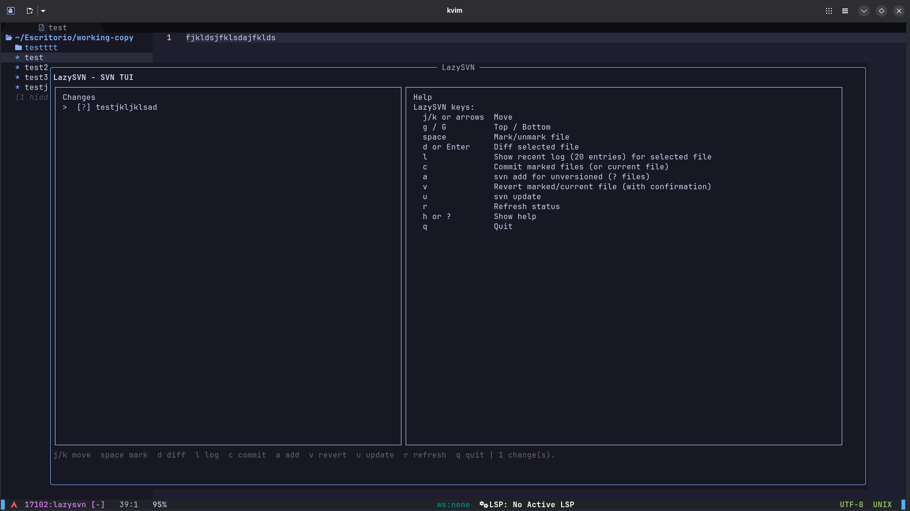
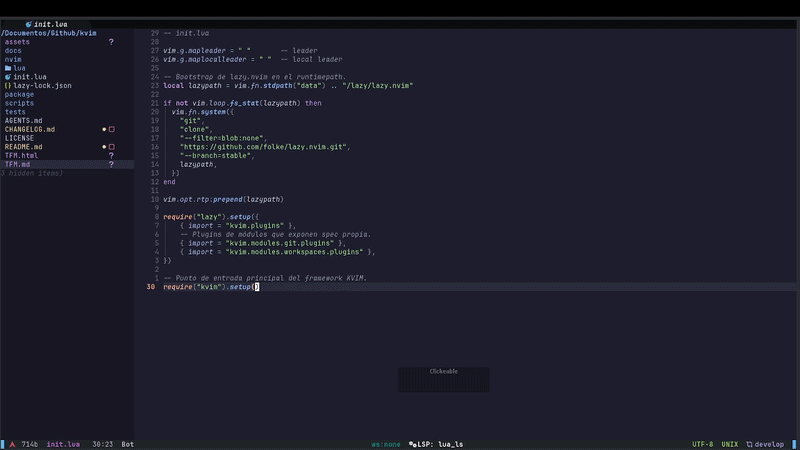
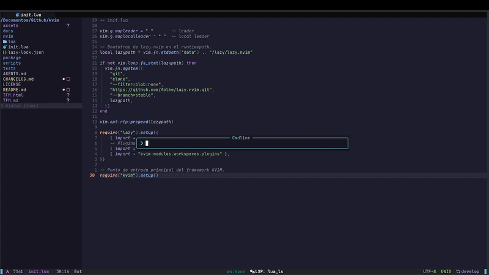
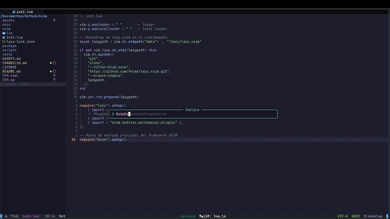

# KVIM - Memoria técnica del proyecto

**Título:** KVIM, entorno IDE modular sobre Neovim y Lua  
**Tipo de documento:** Documentación técnica ampliada  
**Proyecto:** KVIM  
**Fecha:** 2026  

---

## Índice

1. [Introducción](#1-introducción)
2. [Descripción general del proyecto](#2-descripción-general-del-proyecto)
3. [Stack tecnológico utilizado](#3-stack-tecnológico-utilizado)
4. [Información sobre instalación y ejecución](#4-información-sobre-instalación-y-ejecución)
5. [Estructura del proyecto](#5-estructura-del-proyecto)
6. [Funcionamiento general de KVIM](#6-funcionamiento-general-de-kvim)
7. [Funcionalidades principales](#7-funcionalidades-principales)
8. [Limitaciones y consideraciones técnicas](#8-limitaciones-y-consideraciones-técnicas)
9. [Conclusiones](#9-conclusiones)
10. [Anexos](#10-anexos)
11. [Resumen final](#11-resumen-final)

---

## 1. Introducción

### 1.1. Contexto

Neovim se ha consolidado como una base muy potente para construir entornos de desarrollo altamente personalizables. A diferencia de un IDE tradicional monolítico, Neovim permite componer la experiencia de usuario mediante configuración, scripts, plugins y automatizaciones. Sin embargo, esa flexibilidad tiene un coste: crear desde cero una configuración robusta, mantenible y reutilizable exige tiempo, criterio arquitectónico y capacidad de integración entre componentes heterogéneos.

En ese contexto surge **KVIM**, un proyecto orientado a ofrecer una base modular sobre Neovim escrita principalmente en **Lua**, con una arquitectura separada por responsabilidades y preparada para cubrir tanto necesidades de edición general como flujos más específicos, por ejemplo trabajo con repositorios Git, entornos SVN, conexiones remotas por SSH o gestión de workspaces persistentes.

Este documento recoge una explicación extensa del proyecto desde una perspectiva técnica y funcional. El objetivo es que pueda servir para entender las bases de su creación.



*Figura 1. Pantalla inicial de KVIM.*

### 1.2. Alcance

El alcance de KVIM se sitúa a nivel de proyecto y de plataforma de trabajo sobre Neovim. En términos prácticos, el sistema busca proporcionar una base modular reutilizable para edición, navegación, integración con herramientas externas, gestión de sesiones de trabajo y ampliación mediante módulos propios.

Por tanto:

- se describen capacidades que existen o que están reflejadas de forma reconocible en el repositorio;
- se cubren tanto la arquitectura interna como la experiencia de uso visible;
- se incluyen integraciones propias del proyecto, como workspaces, Git, SVN y connections;
- no se documentan configuraciones privadas del usuario que no formen parte del árbol versionado;
- no se plantea KVIM como una idea teórica, sino como una implementación concreta sobre Neovim y Lua.

---

## 2. Descripción general del proyecto

### 2.1. Qué es KVIM

KVIM es una distribución/configuración modular de Neovim construida sobre Lua. Su diseño gira en torno a cuatro pilares principales:

1. un **core reducido**, responsable de la infraestructura común;
2. un conjunto de **módulos funcionales** que encapsulan comportamientos específicos;
3. una capa de **plugins** organizada por áreas temáticas para `lazy.nvim`;
4. una capa de **UI** que da coherencia visual y de interacción al sistema.

No se trata simplemente de una colección de plugins agrupados en carpetas, sino de una base con intención de framework ligero: comandos, acciones, keymaps, carga modular, testing y separación explícita de responsabilidades.

### 2.2. Objetivo del proyecto

El objetivo principal de KVIM es proporcionar una base extensible y mantenible para usar Neovim como IDE modular, evitando dos problemas frecuentes:

- configuraciones monolíticas difíciles de mantener;
- dependencias excesivas entre componentes que hacen costosa la evolución del sistema.

De forma concreta, KVIM busca ofrecer una experiencia integrada para:

- edición de código con UI moderna;
- navegación eficiente entre archivos, buffers y búsquedas;
- soporte LSP y autocompletado;
- integración con flujos de Git y SVN;
- trabajo con conexiones remotas y terminales reproducibles;
- organización por workspaces persistentes.

### 2.3. Enfoque arquitectónico

KVIM adopta una arquitectura por capas:

- **core**: comportamiento base compartido;
- **modules**: funcionalidad opcional o especializada;
- **plugins**: integración con ecosistema externo;
- **ui**: configuración visual y de experiencia de usuario.

Esta separación favorece:

- menor acoplamiento;
- cambios más localizados;
- posibilidad de activar o desactivar módulos;
- mayor claridad al testear o documentar el sistema.

### 2.4. Casos de uso principales

KVIM cubre varios casos de uso relevantes:

- desarrollo general con soporte LSP y autocompletado;
- exploración de archivos y búsqueda en proyecto;
- gestión de repositorios Git mediante LazyGit;
- trabajo con repositorios SVN mediante comandos y LazySVN;
- acceso a sistemas remotos por SSH y persistencia de sesiones activas;
- persistencia de contexto de trabajo mediante workspaces.

### 2.5. Diferenciación respecto a una configuración básica de Neovim

Frente a una configuración básica o puramente personal, KVIM aporta varias características distintivas:

- módulos propios con comandos y keymaps desacoplados;
- sistema de acciones registradas;
- workspaces persistentes con tabs lógicas `code` y `term`;
- integración de conexiones remotas como parte del entorno;
- tests automatizados del comportamiento del sistema.

```mermaid
flowchart TD
    A["KVIM"]

    A --> INIT["Inicialización"]
    A --> CONFIG["Configuración"]
    A --> CORE["Core"]
    A --> MODULES["Módulos"]
    A --> PLUGINS["Plugins"]
    A --> UI["UI"]

    INIT --> INIT1["init.lua / carga"]

    CONFIG --> CONFIG1["config.lua"]
    CONFIG --> CONFIG2["configuración global y local"]

    CORE --> CORE1["comandos"]
    CORE --> CORE2["keymaps"]
    CORE --> CORE3["acciones"]
    CORE --> CORE4["terminales / LSP / health"]

    MODULES --> MOD1["workspaces"]
    MODULES --> MOD2["git"]
    MODULES --> MOD3["svn"]
    MODULES --> MOD4["connections"]

    PLUGINS --> PLUG1["editor / navegación"]
    PLUGINS --> PLUG2["autocompletado / LSP"]
    PLUGINS --> PLUG3["dashboard"]

    UI --> UI1["tema"]
    UI --> UI2["lualine"]
    UI --> UI3["neovide / fuentes"]
```




*Vídeo 1. Uso general de KVIM y primeros pasos dentro del entorno.*

---

## 3. Stack tecnológico utilizado

Para describir correctamente KVIM conviene separar las tecnologías empleadas para desarrollar el proyecto de aquellas que forman parte del producto final ejecutado por el usuario.

### 3.1. Stack tecnológico de desarrollo general

El desarrollo general del proyecto se apoya en:

- **Lua**, como lenguaje principal de implementación;
- **Neovim**, como plataforma de ejecución del propio entorno;
- **Git** como sistema de control de versiones;
- **Git Flow** como estrategia de organización del trabajo, ramas y releases;
- **Shell (Bash)** para scripts de instalación, desinstalación y utilidades en Linux;
- **PowerShell** para instalación, desinstalación y automatización en Windows.

Lua resulta especialmente adecuado en este contexto por ser el lenguaje nativo de la configuración moderna de Neovim, lo que permite una integración directa con la API del editor y con gran parte de su ecosistema.

### 3.2. Stack tecnológico de desarrollo asistido por IA

Una parte diferencial del proceso de desarrollo de KVIM es el uso de **IA agéntica** como apoyo directo a la construcción y mantenimiento del proyecto.

Las piezas principales de esta capa son:

- **OpenCode**, plataforma open-source empleada como entorno de trabajo para agentes;
- **agente principal**, encargado de orquestar el flujo general del proyecto;
- **subagentes especializados**, orientados a áreas concretas como core, módulos, documentación, testing e instaladores;
- **skills**, utilizadas para cargar comportamientos o modos de trabajo concretos;
- **hooks y reglas operativas**, que ayudan a mantener consistencia en el flujo de edición.

Dentro de este stack destaca **Ponytail**, una skill centrada en reducir sobreingeniería y en priorizar soluciones simples, pequeñas y mantenibles. En la práctica, su uso favorece diffs más cortos, menor complejidad accidental y un aprovechamiento más eficiente del contexto y de los tokens durante el desarrollo asistido.

Además, el repositorio incorpora en `.opencode/` la configuración de este entorno, incluyendo agentes propios de KVIM y la activación del plugin asociado a Ponytail.

### 3.3. Stack tecnológico propio de KVIM sobre Neovim

El producto final que utiliza el usuario se construye sobre un stack específico de Neovim organizado en core, plugins, UI y módulos propios.

#### 3.3.1. Gestor de plugins

El sistema de plugins se articula sobre **`lazy.nvim`**, utilizado como gestor y cargador de plugins. Esta elección permite:

- organizar plugins por áreas temáticas;
- delegar carga perezosa cuando procede;
- mantener una estructura modular y legible;
- incorporar plugins aportados por módulos concretos.

#### 3.3.2. Interfaz y experiencia de usuario

La experiencia visual actual de KVIM se apoya en las siguientes piezas:

| Área | Tecnología | Función principal |
|---|---|---|
| Tema | Catppuccin | Apariencia general del editor |
| Statusline | Lualine | Barra de estado |
| Dashboard | Snacks | Pantalla de inicio |
| Explorador | Neo-tree | Árbol de archivos y vistas laterales |
| Búsqueda | Telescope | Búsqueda de archivos, buffers y texto |
| Gestor de archivos | Yazi | Integración externa orientada principalmente a Linux |
| Notificaciones | nvim-notify | Mensajes visuales |
| Command palette | noice.nvim | Interfaz mejorada para `:` y mensajes |
| Select/Input UI | dressing.nvim | Mejora de `vim.ui.select()` y `vim.ui.input()` |
| Línea de buffers | bufferline.nvim | Gestión visual de buffers y apoyo a tabs lógicas de workspace |
| Folds | nvim-ufo | Plegado avanzado |
| Sintaxis/árbol | nvim-treesitter | Resaltado y estructura de código |

Además, el proyecto incorpora plugins complementarios como:

- `which-key.nvim`;
- `smartcolumn.nvim`;
- `vim-visual-multi`;
- `nvim-autopairs`;
- `smear-cursor.nvim` cuando no se está usando Neovide.

#### 3.3.3. Desarrollo y edición de código

Para el soporte de desarrollo y lenguaje, KVIM emplea:

- **`nvim-lspconfig`** para configuración LSP;
- **`mason.nvim`** para gestión de herramientas y servidores;
- **`mason-lspconfig.nvim`** como puente con LSP;
- **`blink.cmp`** como sistema de autocompletado;
- **`friendly-snippets`** como fuente de snippets reutilizables integrada con el autocompletado.

Los servidores LSP configurados actualmente son:

- `lua_ls`;
- `clangd`;
- `pyright`;
- `ts_ls`;
- `bashls`;
- `jsonls`;
- `yamlls`.

#### 3.3.4. Módulos funcionales propios

Los módulos propios de KVIM representan la parte más específica del proyecto. En el estado actual del repositorio existen:

- `workspaces`;
- `git`;
- `svn`;
- `connections`.

Estos módulos añaden comportamiento funcional por encima del editor base y son los responsables de gran parte de la identidad propia de KVIM.

#### 3.3.5. Dependencias externas por funcionalidad

KVIM puede funcionar con distinta profundidad según las dependencias disponibles. Entre las más relevantes se encuentran:

- `git`;
- `ripgrep`;
- `yazi`;
- `lazygit`;
- `svn`;
- `lazysvn`;
- `ssh`;
- `scp`;
- `ssh-keygen`;
- `ssh-copy-id`;
- `picocom`;
- `neovide` como GUI opcional.



*Figura 2. Command palette centrada mediante `noice.nvim`.*

### 3.4. Stack tecnológico de testing

La capa de testing automatizado se construye con:

- **Neovim headless**;
- **`plenary.nvim`**;
- **`busted`**.

Esta combinación permite probar comportamiento Lua, comandos, keymaps, módulos y lógica de integración sin depender de una sesión interactiva manual ni de servicios externos reales.

---

## 4. Información sobre instalación y ejecución

### 4.1. Requisitos previos

Para utilizar KVIM se requiere, como base mínima práctica:

- `git`;
- una versión moderna de **Neovim**.

Además, según los módulos o integraciones que se deseen usar, conviene instalar dependencias adicionales como `ripgrep`, `yazi`, `lazygit`, `svn`, `ssh` o `picocom`.

### 4.2. Instalación en Linux

#### 4.2.1. Instalación rápida

```bash
git clone https://github.com/kodvmv/kvim.git
cd kvim
bash package/linux/install.sh --yes
kvim
```

#### 4.2.2. Instalación con módulos extra

El instalador Linux permite activar módulos adicionales durante la instalación:

```bash
bash package/linux/install.sh --yes \
  --enable-git \
  --enable-svn \
  --enable-connections
```

#### 4.2.3. Qué hace el instalador Linux

En términos prácticos, el instalador Linux:

- copia la configuración a `~/.config/kvim`;
- genera `~/.config/kvim/lua/kvim/local.lua`;
- crea un launcher `kvim`;
- soporta `kvim --gui` con fallback a terminal;
- puede gestionar dependencias opcionales según entorno.

Si se desea evitar ciertas dependencias opcionales:

```bash
bash package/linux/install.sh --yes --skip-optional-deps
```

### 4.3. Instalación en Windows

#### 4.3.1. Instalación rápida

```powershell
git clone https://github.com/kodvmv/kvim.git
cd kvim
powershell -ExecutionPolicy Bypass -File package\windows\install.ps1 --yes
kvim
```

#### 4.3.2. Instalación con módulos extra

```powershell
powershell -ExecutionPolicy Bypass -File package\windows\install.ps1 --yes --enable-git --enable-svn --enable-connections
```

#### 4.3.3. Qué hace el instalador Windows

El instalador Windows:

- copia la configuración a `%LOCALAPPDATA%\kvim`;
- genera `local.lua`;
- crea `kvim.bat`;
- añade la ruta del binario al `PATH` del usuario;
- crea acceso directo en el menú inicio;
- intenta dejar disponible una experiencia de ejecución razonable, incluyendo soporte opcional para `neovide`.

### 4.4. Instalación manual o uso en desarrollo local

Además del instalador, KVIM puede utilizarse manualmente como proyecto de desarrollo. El flujo general consiste en:

1. clonar el repositorio;
2. hacer que Neovim cargue la configuración ubicada en `nvim/`;
3. arrancar usando `NVIM_APPNAME=kvim` o un mecanismo equivalente;
4. verificar el estado con `:checkhealth kvim`.

Esta modalidad resulta especialmente útil para desarrollo, depuración o trabajo directo sobre el repositorio.

### 4.5. Ejecución

Los modos de ejecución esperables son:

```bash
kvim
kvim --gui
kvim fichero.lua
kvim --gui fichero.lua
```

Cuando se solicita el modo GUI, KVIM intenta utilizar `neovide` y, si no está disponible o falla el arranque, hace fallback a ejecución en terminal con `nvim`.

La incorporación de `neovide` no cambia la arquitectura de KVIM, pero sí mejora la experiencia de uso visual: cursor animado, scroll más fluido, renderizado más suave y una sensación de interacción más cercana a la de un IDE gráfico moderno.

### 4.6. Configuración local del usuario

KVIM admite configuración local en:

```text
~/.config/kvim/lua/kvim/local.lua
```

La precedencia de configuración es:

1. defaults definidos en `kvim.config`;
2. configuración local del usuario (`kvim.local`);
3. opciones pasadas programáticamente a `require("kvim").setup(...)`.

Este mecanismo permite mantener separadas varias configuraciones de Neovim: por un lado la configuración habitual del usuario y, por otro, la configuración específica de KVIM. Esa separación es especialmente útil cuando se trabaja con `NVIM_APPNAME`, con launchers propios o con instalaciones independientes del editor.

Ejemplo mínimo:

```lua
return {
    modules = {
        workspaces = { enabled = true },
        git = { enabled = true },
        svn = { enabled = false },
        connections = { enabled = false },
    },
}
```

### 4.7. Consideraciones importantes

Es importante señalar una diferencia práctica entre el comportamiento del repositorio y el de los instaladores:

- los **defaults del proyecto** y los **defaults del `local.lua` generado por instalación** no son idénticos;
- el instalador adopta por defecto una postura más conservadora, activando principalmente `workspaces` y dejando otros módulos opcionales deshabilitados salvo que se soliciten explícitamente.



*Vídeo 2. Proceso de instalación de KVIM en Linux.*


*Vídeo 3. Proceso de desinstalación de KVIM en Linux.*

---

## 5. Estructura del proyecto

### 5.1. Organización general del repositorio

La organización principal del repositorio responde a una separación clara entre configuración ejecutable, scripts de soporte, documentación, assets, testing e infraestructura de agentes.

Árbol simplificado actualizado:

```text
.
├── .opencode/
├── assets/
├── docs/
│   └── specs/
├── nvim/
├── package/
├── scripts/
├── tests/
├── AGENTS.md
├── CHANGELOG.md
├── KVIM_REFERENCE.md
├── README.md
└── TFM.md
```

### 5.2. Directorio `nvim/`

Este directorio contiene la configuración efectiva del editor y el punto de entrada real del sistema. En particular:

- `nvim/init.lua` bootstrappea `lazy.nvim`, declara la importación de plugins base y arranca KVIM;
- `nvim/lua/kvim/init.lua` actúa como punto de entrada Lua del framework y coordina la carga de configuración, core, UI, LSP y módulos.

### 5.3. Flujo de carga del sistema

El flujo de carga puede resumirse así:

1. se bootstrappea `lazy.nvim`;
2. se importan plugins base desde `kvim.plugins.*`;
3. los módulos habilitados pueden aportar plugins adicionales;
4. `require("kvim").setup()` carga:
   - configuración global;
   - comandos core;
   - UI y tema;
   - LSP;
   - módulos habilitados;
   - acciones;
   - keymaps globales.

### 5.4. Core del framework

El core se encuentra en:

```text
nvim/lua/kvim/core/
```

Entre sus piezas principales destacan:

- `commands.lua`;
- `keymaps.lua`;
- `registry.lua`;
- `runner.lua`;
- `terminal.lua`;
- `lsp/`.

Sus responsabilidades son genéricas y compartidas, por ejemplo:

- registrar comandos globales;
- gestionar keymaps globales;
- registrar y ejecutar acciones;
- ofrecer helpers de terminal y ejecución;
- centralizar comportamiento reutilizable.

### 5.5. Sistema de módulos

Los módulos viven en:

```text
nvim/lua/kvim/modules/
```

Un módulo en KVIM puede exponer, según necesidad:

- `setup`;
- `plugins`;
- `actions`;
- `commands`;
- `keymaps`.

Los módulos actuales son:

- `workspaces`;
- `git`;
- `svn`;
- `connections`.

Además, existe una línea de evolución prevista ligada al desarrollo embebido. En etapas anteriores del repositorio se contemplaron integraciones orientadas a flujos con `nrfjprog` y `esp-idf`, pero esas piezas perdieron compatibilidad durante la migración arquitectónica actual. Por ello, su recuperación queda como trabajo futuro, no como funcionalidad activa del estado presente.

### 5.6. Capa de plugins

La organización de plugins por áreas vive en:

```text
nvim/lua/kvim/plugins/
```

Agrupaciones principales actuales:

- `ui.lua`;
- `lsp.lua`;
- `dev.lua`;
- `editor.lua`;
- `dashboard.lua`;
- `navigation.lua`;
- `completion.lua`.

Esto permite mantener la integración con el ecosistema externo bien separada del código específico de módulos y del core.

### 5.7. Capa de UI

La configuración visual propia del proyecto se organiza en:

```text
nvim/lua/kvim/ui/
```

Aquí se encuentran, entre otros:

- `editor.lua`;
- `theme.lua`;
- `lualine.lua`;
- `neovide.lua`;
- `font.lua`;
- `init.lua`.

### 5.8. Testing

La estructura de testing se compone de:

- `scripts/test.sh`;
- `tests/minimal_init.lua`;
- `tests/core/`;
- `tests/core/lsp/`;
- `tests/ui/`;
- `tests/workspaces/`;
- `tests/connections/`.

Esta organización facilita probar áreas concretas sin perder la visión global del sistema.

### 5.9. Documentación y especificaciones internas

Además del README general, el proyecto incluye:

- `CHANGELOG.md`;
- `AGENTS.md`;
- `KVIM_REFERENCE.md`;
- `nvim/lua/kvim/plugins/README.md`;
- `nvim/lua/kvim/modules/workspaces/README.md`;
- `nvim/lua/kvim/modules/git/README.md`;
- `nvim/lua/kvim/modules/svn/README.md`;
- `nvim/lua/kvim/modules/connections/README.md`;
- especificaciones internas en `docs/specs/`.

### 5.10. Infraestructura de agentes y configuración de IA

La carpeta `.opencode/` representa la infraestructura de desarrollo asistido por IA del proyecto. En ella se encuentran:

- la configuración global de OpenCode;
- la activación del plugin de Ponytail;
- los agentes especializados del proyecto KVIM;
- la base de coordinación entre agente principal y subagentes.

Este directorio no forma parte del runtime de Neovim, pero sí del proceso real de construcción, mantenimiento y evolución del repositorio.

---

## 6. Funcionamiento general de KVIM

Esta sección describe de forma clara cómo se conecta KVIM con Neovim sin entrar en las tripas completas de cada fichero.

### 6.1. Punto de entrada real

El arranque comienza en `nvim/init.lua`. Ese fichero:

1. define leader y localleader;
2. bootstrappea `lazy.nvim` en el runtimepath;
3. importa los plugins base del proyecto;
4. importa plugins aportados por módulos que ya exponen spec propia;
5. ejecuta `require("kvim").setup()`.

Por tanto, Neovim no carga KVIM como un bloque monolítico, sino como una secuencia de inicialización en la que primero se prepara el gestor de plugins y después se levanta el framework.

### 6.2. Entrada al framework Lua

Una vez que Neovim llama a `require("kvim").setup()`, el control pasa a `nvim/lua/kvim/init.lua`. Ese punto de entrada coordina el resto del sistema.

El orden general es:

1. cargar configuración global y local;
2. registrar comandos core;
3. inicializar UI base si está habilitada;
4. inicializar tema;
5. inicializar LSP;
6. recorrer los módulos habilitados y cargarlos;
7. registrar finalmente los keymaps globales.

Este orden es importante porque evita que ciertos keymaps o comandos intenten usar piezas que todavía no existen en memoria.

### 6.3. Papel de la configuración

La configuración base vive en `nvim/lua/kvim/config.lua`. Allí se definen:

- opciones de UI;
- keymaps globales;
- configuración de LSP;
- terminales;
- estado por defecto de los módulos.

Después, KVIM intenta cargar `kvim.local` desde `local.lua`, lo que permite personalizar el entorno sin tocar el repositorio. Finalmente, si el arranque recibe opciones directas mediante Lua, esas opciones tienen la máxima prioridad.

### 6.4. Cómo se conectan core y módulos

El core aporta infraestructura, pero no debería contener lógica específica de negocio de cada módulo. La relación real funciona así:

- el **core** registra comandos comunes, keymaps globales, acciones y servicios compartidos;
- cada **módulo** encapsula su propia funcionalidad;
- cuando un módulo está habilitado, KVIM lo carga, le asigna nombre si es necesario, lo registra en el registry y ejecuta su `setup`;
- a partir de ahí, ese módulo puede registrar comandos, acciones, keymaps o plugins propios.

Esto permite que Neovim vea una experiencia unificada, mientras internamente KVIM mantiene una separación razonable entre infraestructura y funcionalidad.

### 6.5. Cómo un módulo se integra en el flujo de Neovim

Un módulo no modifica Neovim de forma arbitraria. Normalmente sigue un patrón reconocible:

1. expone una tabla Lua;
2. define sus acciones reutilizables;
3. define comandos que llaman a esas acciones;
4. define keymaps que llaman a comandos o acciones;
5. opcionalmente expone plugins o configuración propia.

De esta forma, la integración con Neovim se realiza a través de mecanismos nativos del editor —comandos, keymaps, buffers, terminales, LSP o UI— pero manteniendo la lógica agrupada por responsabilidad.

### 6.6. Ejemplo conceptual de interconexión

Un caso representativo es el de `workspaces` y `connections`:

- `connections` puede abrir sesiones SSH o gestionar la conexión activa;
- `workspaces` puede almacenar recetas de terminal y restaurarlas;
- ambos se apoyan en servicios comunes del editor, como terminales, tabs, buffers y notificaciones;
- sin embargo, el core no necesita conocer los detalles de una conexión SSH concreta ni de una receta de workspace concreta.

La consecuencia es que KVIM funciona como una capa de organización sobre Neovim: aprovecha el editor, pero le añade un flujo estructurado y orientado a uso real.

### 6.7. Resultado de ese diseño

Desde el punto de vista del usuario, todo parece un único entorno cohesionado. Desde el punto de vista interno, KVIM reparte responsabilidades entre capas y módulos. Ese equilibrio es precisamente uno de los objetivos centrales del proyecto: que el sistema sea extensible sin convertirse en una configuración monolítica difícil de mantener.

---

## 7. Funcionalidades principales

Esta sección recoge las capacidades públicas más relevantes del sistema.

### 7.1. Experiencia base de edición

KVIM proporciona una experiencia de edición moderna construida sobre varias capas complementarias:

- tema visual con Catppuccin;
- barra de estado con Lualine;
- dashboard inicial con Snacks;
- exploración de archivos con Neo-tree;
- búsquedas rápidas con Telescope;
- integración con Yazi, orientada principalmente a Linux y a entornos donde dicho binario esté instalado;
- notificaciones visuales con `nvim-notify`;
- command palette con `noice.nvim`;
- mejora de selectores e inputs mediante `dressing.nvim`;
- fold avanzado con `nvim-ufo`;
- cierre automático de símbolos con `nvim-autopairs`;
- multiselección con `vim-visual-multi`.

Todo ello busca que el editor no sea únicamente un contenedor de plugins, sino una experiencia coherente y utilizable desde el primer arranque.

### 7.2. Soporte de desarrollo

#### 7.2.1. LSP

KVIM integra soporte LSP para varios lenguajes y ofrece keymaps habituales para:

- ir a definición (`gd`);
- ir a declaración (`gD`);
- consultar referencias (`gr`);
- ir a implementación (`gi`);
- ver documentación (`K`);
- renombrar (`<leader>rn`);
- ejecutar code actions (`<leader>ca`);
- formatear (`<leader>lf`);
- navegar diagnósticos (`[d`, `]d`, `<leader>ld`).

#### 7.2.2. Autocompletado y snippets

El autocompletado se articula mediante `blink.cmp`, complementando el uso de LSP y proporcionando una experiencia de edición más cercana a la de un IDE moderno.

Además, KVIM incorpora soporte para snippets mediante `friendly-snippets`, lo que permite acelerar la escritura de estructuras repetitivas, plantillas de lenguaje y expansiones habituales durante el desarrollo. En conjunto, autocompletado y snippets reducen fricción y favorecen una edición más productiva.

#### 7.2.3. Consideración importante sobre comandos de core

Existe una limitación conocida: en `core/keymaps.lua` aparecen mapeos hacia comandos como `KvimRun`, `KvimTest`, `KvimBuild`, `KvimFormat` y `KvimLint`, pero dichos comandos no están definidos actualmente en `core/commands.lua`. Esta situación debe entenderse como parte del estado todavía no completamente cerrado del proyecto.

### 7.3. Workspaces

El módulo `workspaces` es uno de los rasgos más distintivos de KVIM.

#### 7.3.1. Propósito

Su objetivo es conservar y restaurar contexto de trabajo a nivel de proyecto, evitando que la sesión dependa únicamente de buffers abiertos de forma accidental o temporal.

#### 7.3.2. Capacidades actuales

Entre sus capacidades actuales destacan:

- crear workspaces;
- guardar el workspace actual;
- cargar workspaces existentes;
- listar, eliminar o limpiar workspaces;
- moverse al siguiente o anterior;
- gestionar tabs lógicas `code` y `term`;
- mantener separación entre buffers terminales y buffers de edición;
- definir recetas de terminal;
- restaurar terminales reproducibles;
- ofrecer un hub o zona principal para `term`.

#### 7.3.3. Persistencia

La persistencia del módulo se apoya en:

```text
stdpath("state")/kvim/workspaces
```

Además, el módulo se integra con `resession.nvim` para soporte de sesión.

#### 7.3.4. Tabs lógicas `Code` y `Term`

KVIM diferencia entre dos tabs lógicas principales cuando se está trabajando dentro de un workspace:

- **Code**: orientada a edición y navegación;
- **Term**: orientada a terminales, sesiones SSH y vistas asociadas.

Estas tabs no son una característica global del editor fuera del flujo de workspace, sino una convención propia del módulo `workspaces` para estructurar mejor el contexto del proyecto.

#### 7.3.5. Limitaciones actuales

Entre las limitaciones razonables del módulo se pueden señalar:

- la restauración no equivale a recuperar procesos interactivos vivos exactamente donde estaban;
- la UI de selección puede depender del backend de `vim.ui.select()` disponible;
- todavía puede haber margen de pulido en algunos flujos de restauración avanzada;
- existe un bug visual conocido relacionado con el cambio entre tabs `Code` y `Term` y el resaltado asociado a esa transición.



*Vídeo 4. Creación de una conexión desde el contexto de un workspace y uso de las tabs `Code` y `Term`.*

### 7.4. Integración Git

El módulo `git` integra **LazyGit** como herramienta principal de interacción con repositorios Git.

#### 7.4.1. Comandos públicos

- `:KvimGit`;
- `:KvimGitFile`;
- `:KvimGitConfig`.

#### 7.4.2. Aportación al flujo de trabajo

Esto permite trabajar sobre el repositorio completo o sobre el archivo actual sin abandonar el editor. Se trata de una integración pragmática, apoyada en una herramienta ya consolidada, en lugar de reinventar internamente toda la interfaz de Git.



*Figura 3. Integración de LazyGit dentro de KVIM.*

### 7.5. Integración SVN

El módulo `svn` cubre un caso de uso menos habitual en configuraciones modernas, pero todavía relevante en determinados contextos profesionales o heredados.

#### 7.5.1. Comandos públicos

- `:KvimLazySvn`;
- `:KvimSvnInfo`;
- `:KvimSvnStatus`.

#### 7.5.2. Aportación al flujo de trabajo

Su finalidad es facilitar la apertura de LazySVN y la consulta del estado o de la información del working copy desde el propio editor, manteniendo una experiencia similar en estructura a la del módulo Git aunque sobre una herramienta distinta.



*Figura 4. Integración de LazySVN dentro de KVIM.*

### 7.6. Módulo Connections

El módulo `connections` es probablemente la parte más orientada a flujos de trabajo reales sobre sistemas remotos.

#### 7.6.1. Tipos de conexión soportados

El sistema contempla conexiones:

- **SSH**;
- **serie**.

No obstante, el foco principal del desarrollo actual se ha centrado en la parte de **conexión SSH**, que es donde se encuentra la funcionalidad más madura y completa.

#### 7.6.2. Capacidades públicas principales

Entre sus comandos principales se encuentran:

- pickers generales o específicos (`KvimConnections`, `KvimSshConnections`, `KvimSerialConnections`);
- recarga de configuración (`KvimConnectionsReload`);
- reconexión (`KvimConnectionsReconnect`);
- listado, alta y borrado de conexiones;
- gestión de claves SSH;
- selección de conexión activa;
- ejecución remota de comandos por SSH;
- subida y bajada de archivos mediante SCP.



*Vídeo 5. Alta interactiva de una conexión SSH desde KVIM.*

#### 7.6.3. Gestión de claves SSH

El módulo permite:

- generar claves;
- instalar la clave pública en el remoto;
- realizar un setup completo de autenticación;
- probar la conexión SSH.



*Vídeo 6. Flujo de generación e instalación de claves SSH.*

#### 7.6.4. Conexión activa

KVIM mantiene el concepto de **conexión activa** en memoria de sesión, lo que simplifica operaciones como:

- ejecutar comandos remotos;
- subir el archivo actual;
- descargar rutas remotas;
- cambiar o limpiar el destino activo.



*Vídeo 7. Apertura y uso de una conexión SSH activa desde KVIM.*

#### 7.6.5. Configuración externa del usuario

Las conexiones del usuario viven fuera del árbol versionado, normalmente en:

```text
~/.config/kvim/connections.lua
```

Esta decisión evita mezclar información sensible o específica de entorno con el código fuente compartido del proyecto.

Las conexiones serie existen en la arquitectura del módulo, pero siguen menos desarrolladas que el flujo SSH.

### 7.7. Comandos principales del sistema

Para evitar que esta memoria crezca innecesariamente, la referencia completa de comandos se centraliza en:

- [KVIM_REFERENCE.md](KVIM_REFERENCE.md)

Ese documento reúne los comandos reales del core y de los módulos actuales, agrupados por área funcional.

### 7.8. Keymaps destacados

Del mismo modo, la referencia completa de keymaps se centraliza en:

- [KVIM_REFERENCE.md](KVIM_REFERENCE.md)

En términos generales, los keymaps más relevantes se agrupan en:

- personales y globales;
- exploración y búsqueda;
- terminal;
- workspaces;
- Git;
- SVN;
- connections;
- LSP;
- folds y navegación rápida entre buffers.

### 7.9. Integración entre módulos y capas

Una de las fortalezas del proyecto es cómo se conectan sus partes sin mezclar responsabilidades de forma excesiva. Ejemplos claros:

- `workspaces` puede usar terminales y recetas asociadas a `connections`;
- los módulos exponen comandos y keymaps, pero la infraestructura base sigue en el core;
- los plugins se organizan por áreas, mientras la lógica funcional permanece en módulos o core;
- la UI refuerza el uso de módulos sin incrustar toda la lógica funcional en la capa visual.

---

## 8. Limitaciones y consideraciones técnicas

### 8.1. Aspectos sólidos del proyecto

En el estado actual del desarrollo, pueden considerarse relativamente sólidos:

- la arquitectura modular general;
- el uso de `lazy.nvim` como base de integración de plugins;
- la experiencia base de UI;
- el soporte LSP principal;
- los módulos `workspaces`, `git`, `svn` y `connections`;
- los instaladores Linux y Windows;
- la suite de testing headless.

### 8.2. Limitaciones conocidas

Entre las limitaciones o incoherencias visibles actualmente conviene destacar:

- existen mappings de core hacia comandos que no están definidos todavía;
- no toda la configuración pública refleja con precisión toda la realidad interna del cableado;
- parte de la documentación secundaria puede quedarse por detrás del código real;
- algunos comportamientos de UI y restauración todavía están en fase de pulido;
- existe un bug visual conocido en el flujo de tabs `Code`/`Term` de workspaces;
- en ciertos contextos aparecen mensajes de error o avisos de `noice.nvim` que todavía no se han aislado y corregido por completo.

### 8.3. Decisiones de diseño relevantes

Algunas decisiones del diseño merecen ser señaladas de forma explícita:

- mantener un **core pequeño** y genérico;
- evitar introducir lógica específica de módulo dentro del core salvo cuando sea reutilizable;
- usar configuración local fuera del árbol versionado para datos específicos del usuario;
- diseñar tests sin depender de red real ni credenciales sensibles.

---

## 9. Conclusiones

KVIM representa una propuesta técnica seria para construir un entorno modular sobre Neovim. El proyecto combina una base visual moderna, integración con herramientas consolidadas del ecosistema y módulos propios orientados a casos de uso reales.

Su valor no reside únicamente en reunir plugins populares, sino en ofrecer una estructura mantenible y extensible donde el core, los módulos, la UI y el testing tienen responsabilidades relativamente bien definidas.

KVIM resulta interesante porque muestra:

- diseño modular aplicado a un editor extensible;
- integración entre componentes de distinta naturaleza;
- equilibrio entre personalización y mantenibilidad;
- preocupación por testing, documentación y experiencia de usuario.

Aunque todavía existan áreas en consolidación, el proyecto ya ofrece una base funcional con identidad propia y un camino técnico reconocible.

---

## 10. Anexos

### 10.1. Anexo A. Árbol ampliado del proyecto

```text
.
├── .opencode/
│   ├── agents/
│   │   ├── kvim-core.md
│   │   ├── kvim-docs.md
│   │   ├── kvim-installer.md
│   │   ├── kvim-main.md
│   │   ├── kvim-module.md
│   │   └── kvim-tester.md
│   ├── opencode.json
│   ├── package.json
│   └── package-lock.json
├── assets/
│   ├── docs/
│   │   ├── gifs/
│   │   │   ├── add-ssh.gif
│   │   │   ├── connect-ssh.gif
│   │   │   ├── home.gif
│   │   │   ├── install.gif
│   │   │   ├── pub-priv.gif
│   │   │   ├── uninstall.gif
│   │   │   └── workspace-term-code.gif
│   │   └── images/
│   │       ├── command-palette.png
│   │       ├── home-screen.png
│   │       ├── lazygit.png
│   │       ├── lazysvn.png
│   │       └── proyecto-neo-tree.png
│   ├── fonts/
│   └── kvim-logo.png
├── docs/
│   └── specs/
│       ├── 0001-linux-installer.md
│       ├── 0002-windows-installer.md
│       ├── 0003-user-connections-configuration.md
│       └── 0004-term-tab-code-explorer-separation.md
├── nvim/
│   ├── init.lua
│   ├── lazy-lock.json
│   └── lua/
│       └── kvim/
│           ├── config.lua
│           ├── health.lua
│           ├── init.lua
│           ├── core/
│           │   ├── commands.lua
│           │   ├── keymaps.lua
│           │   ├── registry.lua
│           │   ├── runner.lua
│           │   ├── terminal.lua
│           │   └── lsp/
│           ├── modules/
│           │   ├── connections/
│           │   ├── git/
│           │   ├── svn/
│           │   └── workspaces/
│           ├── plugins/
│           │   ├── README.md
│           │   ├── completion.lua
│           │   ├── dashboard.lua
│           │   ├── dev.lua
│           │   ├── editor.lua
│           │   ├── init.lua
│           │   ├── lsp.lua
│           │   ├── navigation.lua
│           │   └── ui.lua
│           └── ui/
│               ├── editor.lua
│               ├── font.lua
│               ├── init.lua
│               ├── lualine.lua
│               ├── neovide.lua
│               └── theme.lua
├── package/
│   ├── linux/
│   │   ├── install.sh
│   │   └── uninstall.sh
│   └── windows/
│       ├── install.ps1
│       └── uninstall.ps1
├── scripts/
│   └── test.sh
├── tests/
│   ├── minimal_init.lua
│   ├── connections/
│   ├── core/
│   │   └── lsp/
│   ├── ui/
│   └── workspaces/
├── AGENTS.md
├── CHANGELOG.md
├── KVIM_REFERENCE.md
├── LICENSE
├── README.md
└── TFM.md
```

### 10.2. Anexo B. Ejemplo mínimo de `local.lua`

`local.lua` es el fichero de configuración local del usuario para KVIM. Su finalidad es permitir personalización sin modificar el repositorio y sin mezclar la configuración general del usuario con la configuración específica de esta distribución.

Ejemplo mínimo:

```lua
return {
    modules = {
        workspaces = { enabled = true },
        git = { enabled = true },
        svn = { enabled = false },
        connections = { enabled = false },
    },
}
```

### 10.3. Anexo C. Ejemplo orientativo de `connections.lua`

`connections.lua` es el fichero de configuración de conexiones del usuario. Se almacena fuera del árbol versionado y permite definir conexiones reutilizables para SSH y, en menor medida, para flujos serie.

Debe devolver una tabla Lua. Formato orientativo:

```lua
return {
    connections = {
        {
            type = "ssh",
            name = "demo-server",
            host = "example.com",
            user = "user",
            port = 22,
            identity_file = "~/.ssh/id_ed25519",
            remote_root = "/home/user/project",
            options = {
                IdentitiesOnly = "yes",
            },
            transfer = {
                remote_root = "/home/user/project",
                local_root = "~/Downloads",
            },
        },
        {
            type = "serial",
            name = "demo-uart",
            device = "/dev/ttyUSB0",
            baudrate = 115200,
            command = "picocom",
        },
    },
}
```

Campos más relevantes:

- `type`: tipo de conexión, normalmente `ssh` o `serial`.
- `name`: nombre identificativo de la conexión.
- `host`: host o IP del destino SSH.
- `user`: usuario remoto.
- `port`: puerto SSH si no se usa el 22 por defecto.
- `identity_file`: ruta a la clave privada usada por la conexión.
- `remote_root`: ruta remota base útil para flujos de trabajo y transferencias.
- `options`: opciones adicionales de SSH, por ejemplo `IdentitiesOnly`.
- `transfer`: bloque de configuración para subida y bajada de archivos.
  - `transfer.remote_root`: raíz remota para transferencias.
  - `transfer.local_root`: raíz local por defecto.
- `device`: dispositivo serie, por ejemplo `/dev/ttyUSB0`.
- `baudrate`: velocidad de la conexión serie.
- `command`: comando a usar para la sesión serie, por ejemplo `picocom`.

> Debe rellenarse siempre con datos ficticios o anonimizados. No debe incluir secretos reales.

### 10.4. Anexo D. Comando de testing

Comando principal:

```bash
./scripts/test.sh
```

Este script ejecuta Neovim en modo headless usando `tests/minimal_init.lua`, lanza `PlenaryBustedDirectory` sobre el directorio `tests/`, captura la salida completa, elimina códigos ANSI para poder analizarla con fiabilidad y finalmente muestra un resumen con:

- número de tests correctos;
- número de tests fallidos;
- número de errores;
- total agregado.

Si el proceso de Neovim falla o aparece cualquier fallo/error en la suite, el script termina con código de error.

---

## 11. Resumen final

KVIM es un IDE modular construido sobre Neovim y Lua que combina:

- una arquitectura por capas clara;
- integración moderna de UI y plugins;
- módulos propios útiles para trabajo real;
- soporte para LSP, terminales, control de versiones y conexiones remotas;
- testing automatizado y documentación estructurada.

Su principal valor reside en cómo organiza esas piezas: Neovim aporta la base, `lazy.nvim` gestiona el ecosistema de plugins, el core coordina la infraestructura común y los módulos añaden funcionalidad especializada sin romper la separación de responsabilidades.
