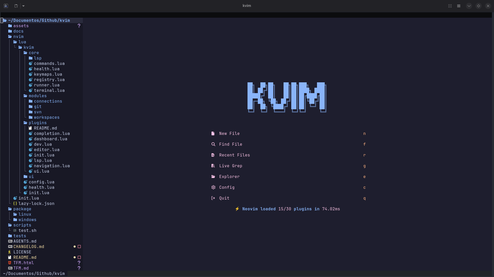

# KVIM - Memoria técnica del proyecto

**Título:** KVIM, entorno IDE modular sobre Neovim y Lua  
**Tipo de documento:** Documentación técnica ampliada  
**Proyecto:** KVIM  
**Estado del documento:** Borrador sólido para memoria/TFM  
**Fecha:** 2026  

---

## 1. Introducción

### 1.1. Contexto

Neovim se ha consolidado como una base muy potente para construir entornos de desarrollo altamente personalizables. A diferencia de un IDE tradicional monolítico, Neovim permite componer la experiencia de usuario mediante configuración, scripts, plugins y automatizaciones. Sin embargo, esa flexibilidad tiene un coste: crear desde cero una configuración robusta, mantenible y reutilizable exige tiempo, criterio arquitectónico y capacidad de integración entre componentes heterogéneos.

En ese contexto surge **KVIM**, un proyecto orientado a ofrecer una base modular sobre Neovim escrita principalmente en **Lua**, con una arquitectura separada por responsabilidades y preparada para cubrir tanto necesidades de edición general como flujos más específicos, por ejemplo trabajo con repositorios Git, entornos SVN, conexiones remotas por SSH o gestión de workspaces persistentes.

Este documento recoge una explicación extensa del proyecto desde una perspectiva técnica y funcional. El objetivo es que pueda servir para entender las bases de su creación.


### 1.2. Objeto del documento

El propósito de este documento es describir con claridad:

- qué es KVIM y cuál es su objetivo;
- qué tecnologías utiliza;
- cómo se instala y ejecuta;
- cómo está organizado internamente el proyecto;
- cuáles son sus funcionalidades principales en el estado actual.

### 1.3. Alcance

Este documento cubre el estado **real y actual** del repositorio, no una hoja de ruta ideal o futura. Por tanto:

- se describen únicamente capacidades que existen o están cableadas de forma visible en el código;
- se incluyen limitaciones y zonas en consolidación cuando resulta relevante;
- no se profundiza en comparativas extensas con otras distribuciones de Neovim;
- no se documentan personalizaciones privadas del usuario que no formen parte del árbol versionado.

### 1.4. Estado actual del proyecto

KVIM es actualmente un proyecto **usable**, con una arquitectura modular real, plugins integrados por áreas, módulos funcionales propios y una suite de tests automatizados en modo headless. Aun así, algunas piezas siguen evolucionando y conviene entenderlo como un sistema en crecimiento, no como una plataforma completamente cerrada a nivel interno.

---

## 2. Descripción general del proyecto

### 2.1. Qué es KVIM

KVIM es una distribución/configuración modular de Neovim construida sobre Lua. Su diseño gira en torno a cuatro pilares principales:

1. un **core reducido**, responsable de la infraestructura común;
2. un conjunto de **módulos funcionales** que encapsulan comportamientos específicos;
3. una capa de **plugins** organizada por áreas temáticas para `lazy.nvim`;
4. una capa de **UI** que da coherencia visual y de interacción al sistema.

No se trata simplemente de una colección de plugins agrupados en carpetas, sino de una base con intención de framework ligero: comandos, acciones, keymaps, carga modular, testing y separación explícita de responsabilidades.

### 2.2. Objetivo del proyecto

El objetivo principal de KVIM es proporcionar una base extensible y mantenible para usar Neovim como IDE modular, evitando dos problemas frecuentes:

- configuraciones monolíticas difíciles de mantener;
- dependencias excesivas entre componentes que hacen costosa la evolución del sistema.

De forma concreta, KVIM busca ofrecer una experiencia integrada para:

- edición de código con UI moderna;
- navegación eficiente entre archivos, buffers y búsquedas;
- soporte LSP y autocompletado;
- integración con flujos de Git y SVN;
- trabajo con conexiones remotas y terminales reproducibles;
- organización por workspaces persistentes.

### 2.3. Enfoque arquitectónico

KVIM adopta una arquitectura por capas:

- **core**: comportamiento base compartido;
- **modules**: funcionalidad opcional o especializada;
- **plugins**: integración con ecosistema externo;
- **ui**: configuración visual y de experiencia de usuario.

Esta separación favorece:

- menor acoplamiento;
- cambios más localizados;
- posibilidad de activar o desactivar módulos;
- mayor claridad al testear o documentar el sistema.

### 2.4. Casos de uso principales

En su estado actual, KVIM cubre varios casos de uso relevantes:

- desarrollo general con soporte LSP y autocompletado;
- exploración de archivos y búsqueda en proyecto;
- gestión de repositorios Git mediante LazyGit;
- trabajo con repositorios SVN mediante comandos y LazySVN;
- acceso a sistemas remotos por SSH y persistencia de sesiones activas;
- persistencia de contexto de trabajo mediante workspaces.

### 2.5. Diferenciación respecto a una configuración básica de Neovim

Frente a una configuración básica o puramente personal, KVIM aporta varias características distintivas:

- módulos propios con comandos y keymaps desacoplados;
- sistema de acciones registradas;
- workspaces persistentes con tabs lógicas `code` y `term`;
- integración de conexiones remotas como parte del entorno;
- tests automatizados del comportamiento del sistema.

flowchart TD
    A["KVIM"]

    A --> INIT["Inicialización"]
    A --> CONFIG["Configuración"]
    A --> CORE["Core"]
    A --> MODULES["Módulos"]
    A --> PLUGINS["Plugins"]
    A --> UI["UI"]

    INIT --> INIT1["init.lua / carga"]

    CONFIG --> CONFIG1["config.lua"]
    CONFIG --> CONFIG2["configuración global y local"]

    CORE --> CORE1["comandos"]
    CORE --> CORE2["keymaps"]
    CORE --> CORE3["acciones"]
    CORE --> CORE4["terminales / LSP / health"]

    MODULES --> MOD1["workspaces"]
    MODULES --> MOD2["git"]
    MODULES --> MOD3["svn"]
    MODULES --> MOD4["connections"]

    PLUGINS --> PLUG1["editor / navegación"]
    PLUGINS --> PLUG2["autocompletado / LSP"]
    PLUGINS --> PLUG3["dashboard"]

    UI --> UI1["tema"]
    UI --> UI2["lualine"]
    UI --> UI3["neovide / fuentes"]


---

## 3. Stack tecnológico utilizado

### 3.1. Lenguajes y base de ejecución

KVIM utiliza como tecnologías principales:

- **Lua** como lenguaje principal de implementación;
- **Neovim** como plataforma de ejecución;
- **Shell (Bash)** para scripts de instalación/desinstalación en Linux;
- **PowerShell** para instalación/desinstalación en Windows.
- **IA Agéntica** para la codificación del proyecto
    -**Agentes**, orquestador de los subagentes
    -**Subagentes**, agentes desarrollados para tareas específicas y gestionandos por el agente orquestado
    -**Opencode**, plataforma open-source que hace posible el uso de la IA agéntica
    -**Ponytail**, uso de la skill para optimizar la programación y reducción del uso de tokens
- **Git Flow** para la gestión del proyecto, branches, releases ...
Lua resulta especialmente adecuado en este contexto por ser el lenguaje nativo de la configuración moderna de Neovim, lo que permite una integración natural con su API y con la mayor parte del ecosistema actual de plugins.

### 3.2. Gestor de plugins

El sistema de plugins se articula sobre **`lazy.nvim`**, utilizado como gestor y cargador de plugins. Esta elección permite:

- organizar plugins por áreas temáticas;
- delegar carga perezosa cuando procede;
- mantener una estructura modular y legible;
- incorporar plugins aportados por módulos concretos.

### 3.3. Stack de interfaz y experiencia de usuario

La experiencia visual actual de KVIM se apoya en las siguientes piezas:

| Área | Tecnología | Función principal |
|---|---|---|
| Tema | Catppuccin | Apariencia general del editor |
| Statusline | Lualine | Barra de estado |
| Dashboard | Snacks | Pantalla de inicio |
| Explorador | Neo-tree | Árbol de archivos y vistas laterales |
| Búsqueda | Telescope | Búsqueda de archivos, buffers y texto |
| Gestor de archivos | Yazi | Integración con explorador externo |
| Notificaciones | nvim-notify | Mensajes visuales |
| Command palette | noice.nvim | Interfaz mejorada para `:` y mensajes |
| Select/Input UI | dressing.nvim | Mejora de `vim.ui.select()` y `vim.ui.input()` |
| Línea de buffers | bufferline.nvim | Gestión visual de buffers y tabs lógicas |
| Folds | nvim-ufo | Plegado avanzado |
| Sintaxis/árbol | nvim-treesitter | Resaltado y estructura de código |

Además, el proyecto incorpora plugins complementarios como:

- `smartcolumn.nvim`;
- `vim-visual-multi`;
- `nvim-autopairs`;
- `which-key.nvim`;
- `smear-cursor.nvim` en contextos donde no se usa Neovide.

### 3.4. Stack de desarrollo

Para el soporte de desarrollo y lenguaje, KVIM emplea:

- **`nvim-lspconfig`** para configuración LSP;
- **`mason.nvim`** para gestión de herramientas y servidores;
- **`mason-lspconfig.nvim`** como puente con LSP;
- **`blink.cmp`** como sistema de autocompletado.

### 3.5. Servidores LSP actualmente configurados

En el estado actual del proyecto aparecen configurados los siguientes servidores:

- `lua_ls`
- `clangd`
- `pyright`
- `ts_ls`
- `bashls`
- `jsonls`
- `yamlls`

Estos cubren una base razonable para desarrollo en Lua, C/C++, Python, TypeScript/JavaScript, Bash, JSON y YAML.

### 3.6. Dependencias externas por funcionalidad

KVIM puede funcionar con distinta profundidad según las dependencias disponibles. Entre las más relevantes se encuentran:

- `git`;
- `ripgrep`;
- `yazi`;
- `lazygit`;
- `svn`;
- `lazysvn`;
- `ssh`;
- `scp`;
- `ssh-keygen`;
- `ssh-copy-id`;
- `picocom`;
- `neovide` como GUI opcional.

### 3.7. Stack de testing

La capa de testing automatizado se construye con:

- **Neovim headless**;
- **`plenary.nvim`**;
- **`busted`**.

Esta combinación permite probar comportamiento Lua y lógica de integración sin depender de una sesión interactiva manual.


**[Insertar tabla o figura: resumen del stack tecnológico]**

---

## 4. Información sobre instalación y ejecución

### 4.1. Requisitos previos

Para utilizar KVIM se requiere, como base mínima práctica:

- `git`;
- una versión moderna de **Neovim**.

Además, según los módulos o integraciones que se deseen usar, conviene instalar dependencias adicionales como `ripgrep`, `yazi`, `lazygit`, `svn`, `ssh` o `picocom`.

### 4.2. Instalación en Linux

#### 4.2.1. Instalación rápida

```bash
git clone https://github.com/kodvmv/kvim.git
cd kvim
bash package/linux/install.sh --yes
kvim
```

#### 4.2.2. Instalación con módulos extra

El instalador Linux permite activar módulos adicionales durante la instalación:

```bash
bash package/linux/install.sh --yes \
  --enable-git \
  --enable-svn \
  --enable-connections
```

#### 4.2.3. Qué hace el instalador Linux

En términos prácticos, el instalador Linux:

- copia la configuración a `~/.config/kvim`;
- genera `~/.config/kvim/lua/kvim/local.lua`;
- crea un launcher `kvim`;
- soporta `kvim --gui` con fallback a terminal;
- puede gestionar dependencias opcionales según entorno.

Si se desea evitar ciertas dependencias opcionales:

```bash
bash package/linux/install.sh --yes --skip-optional-deps
```

### 4.3. Instalación en Windows

#### 4.3.1. Instalación rápida

```powershell
git clone https://github.com/kodvmv/kvim.git
cd kvim
powershell -ExecutionPolicy Bypass -File package\windows\install.ps1 --yes
kvim
```

#### 4.3.2. Instalación con módulos extra

```powershell
powershell -ExecutionPolicy Bypass -File package\windows\install.ps1 --yes --enable-git --enable-svn --enable-connections
```

#### 4.3.3. Qué hace el instalador Windows

El instalador Windows:

- copia la configuración a `%LOCALAPPDATA%\kvim`;
- genera `local.lua`;
- crea `kvim.bat`;
- añade la ruta del binario al `PATH` del usuario;
- crea acceso directo en el menú inicio;
- intenta dejar disponible una experiencia de ejecución razonable, incluyendo soporte opcional para `neovide`.

### 4.4. Instalación manual o uso en desarrollo local

Además del instalador, KVIM puede utilizarse manualmente como proyecto de desarrollo. El flujo general consiste en:

1. clonar el repositorio;
2. hacer que Neovim cargue la configuración ubicada en `nvim/`;
3. arrancar usando `NVIM_APPNAME=kvim` o un mecanismo equivalente;
4. verificar el estado con `:checkhealth kvim`.

Esta modalidad resulta especialmente útil para desarrollo, depuración o trabajo directo sobre el repositorio.

### 4.5. Ejecución

Los modos de ejecución esperables son:

```bash
kvim
kvim --gui
kvim fichero.lua
kvim --gui fichero.lua
```

Cuando se solicita el modo GUI, KVIM intenta utilizar `neovide` y, si no está disponible o falla el arranque, hace fallback a ejecución en terminal con `nvim`.

### 4.6. Configuración local del usuario

KVIM admite configuración local en:

```text
~/.config/kvim/lua/kvim/local.lua
```

La precedencia de configuración es:

1. defaults definidos en `kvim.config`;
2. configuración local del usuario (`kvim.local`);
3. opciones pasadas programáticamente a `require("kvim").setup(...)`.

Ejemplo mínimo:

```lua
return {
    modules = {
        workspaces = { enabled = true },
        git = { enabled = true },
        svn = { enabled = false },
        connections = { enabled = false },
    },
}
```

### 4.7. Consideraciones importantes

Es importante señalar una diferencia práctica entre el comportamiento del repositorio y el de los instaladores:

- los **defaults del proyecto** y los **defaults del `local.lua` generado por instalación** no son idénticos;
- el instalador adopta por defecto una postura más conservadora, activando principalmente `workspaces` y dejando otros módulos opcionales deshabilitados salvo que se soliciten explícitamente.


---

## 5. Estructura del proyecto

### 5.1. Organización general del repositorio

La organización principal del repositorio responde a una separación clara entre configuración ejecutable, scripts de soporte, tests y documentación.

Árbol simplificado:

```text
.
├── nvim/
├── package/
├── scripts/
├── tests/
├── docs/specs/
├── README.md
├── CHANGELOG.md
├── AGENTS.md
└── TFM.md
```

### 5.2. Directorio `nvim/`

Este directorio contiene la configuración efectiva del editor.

#### 5.2.1. `nvim/init.lua`

Es el punto de entrada de Neovim. Su responsabilidad principal es bootstrappear el entorno y delegar la carga modular correspondiente.

#### 5.2.2. `nvim/lua/kvim/init.lua`

Es el punto de entrada Lua de KVIM. Desde aquí se desencadena la secuencia real de configuración del sistema.

### 5.3. Flujo de carga del sistema

El flujo de carga puede resumirse así:

1. se bootstrappea `lazy.nvim`;
2. se importan plugins base desde `kvim.plugins.*`;
3. los módulos habilitados pueden aportar plugins adicionales;
4. `require("kvim").setup()` carga:
   - configuración global;
   - comandos core;
   - UI y tema;
   - LSP;
   - módulos habilitados;
   - acciones;
   - keymaps globales.

### 5.4. Core del framework

El core se encuentra en:

```text
nvim/lua/kvim/core/
```

Entre sus piezas principales destacan:

- `commands.lua`
- `keymaps.lua`
- `registry.lua`
- `runner.lua`
- `terminal.lua`
- `lsp/`

Sus responsabilidades son genéricas y compartidas, por ejemplo:

- registrar comandos globales;
- gestionar keymaps globales;
- registrar y ejecutar acciones;
- ofrecer helpers de terminal y ejecución;
- centralizar comportamiento reutilizable.

### 5.5. Sistema de módulos

Los módulos viven en:

```text
nvim/lua/kvim/modules/
```

Un módulo en KVIM puede exponer, según necesidad:

- `setup`
- `plugins`
- `actions`
- `commands`
- `keymaps`

Los módulos actuales son:

- `workspaces`
- `git`
- `svn`
- `connections`

### 5.6. Capa de plugins

La organización de plugins por áreas vive en:

```text
nvim/lua/kvim/plugins/
```

Agrupaciones principales actuales:

- `ui.lua`
- `lsp.lua`
- `dev.lua`
- `editor.lua`
- `dashboard.lua`
- `navigation.lua`
- `completion.lua`

Esto permite mantener la integración con el ecosistema externo bien separada del código específico de módulos y del core.

### 5.7. Capa de UI

La configuración visual propia del proyecto se organiza en:

```text
nvim/lua/kvim/ui/
```

Aquí se encuentran, entre otros:

- `editor.lua`
- `theme.lua`
- `lualine.lua`
- `init.lua`

### 5.8. Testing

La estructura de testing se compone de:

- `scripts/test.sh`
- `tests/minimal_init.lua`
- `tests/core/`
- `tests/core/lsp/`
- `tests/ui/`
- `tests/workspaces/`
- `tests/connections/`

Esta organización facilita probar áreas concretas sin perder la visión global del sistema.

### 5.9. Documentación y especificaciones internas

Además del README general, el proyecto incluye:

- `CHANGELOG.md`;
- `AGENTS.md`;
- READMEs específicos de módulos;
- especificaciones internas en `docs/specs/`.

**[Insertar esquema: arquitectura por capas]**


---

## 6. Funcionalidades principales

Esta sección recoge las capacidades públicas más relevantes del sistema en su estado actual.

### 6.1. Experiencia base de edición

KVIM proporciona una experiencia de edición moderna construida sobre varias capas complementarias:

- tema visual con Catppuccin;
- barra de estado con Lualine;
- dashboard inicial con Snacks;
- exploración de archivos con Neo-tree;
- búsquedas rápidas con Telescope;
- integración con Yazi;
- notificaciones visuales con `nvim-notify`;
- command palette con `noice.nvim`;
- mejora de selectores e inputs mediante `dressing.nvim`;
- fold avanzado con `nvim-ufo`;
- cierre automático de simbolos como parentesis, corchetes con `nvim-autopairs`;
- multiselección con `vim-visual-multi`.

Todo ello busca que el editor no sea únicamente un contenedor de plugins, sino una experiencia coherente y utilizable desde el primer arranque.

### 6.2. Soporte de desarrollo

#### 6.2.1. LSP

KVIM integra soporte LSP para varios lenguajes y ofrece keymaps habituales para:

- ir a definición (`gd`);
- ir a declaración (`gD`);
- consultar referencias (`gr`);
- ir a implementación (`gi`);
- ver documentación (`K`);
- renombrar (`<leader>rn`);
- ejecutar code actions (`<leader>ca`);
- formatear (`<leader>lf`);
- navegar diagnósticos (`[d`, `]d`, `<leader>ld`).

#### 6.2.2. Autocompletado

El autocompletado se articula mediante `blink.cmp`, complementando el uso de LSP y proporcionando una experiencia de edición más cercana a la de un IDE moderno.

#### 6.2.3. Consideración importante sobre comandos de core

Existe una limitación conocida: en `core/keymaps.lua` aparecen mapeos hacia comandos como `KvimRun`, `KvimTest`, `KvimBuild`, `KvimFormat` y `KvimLint`, pero dichos comandos no están definidos actualmente en `core/commands.lua`. Esta situación debe entenderse como parte del estado en consolidación del proyecto.

### 6.3. Workspaces

El módulo `workspaces` es uno de los rasgos más distintivos de KVIM.

#### 6.3.1. Propósito

Su objetivo es conservar y restaurar contexto de trabajo a nivel de proyecto, evitando que la sesión dependa únicamente de buffers abiertos de forma accidental o temporal.

#### 6.3.2. Capacidades actuales

Entre sus capacidades actuales destacan:

- crear workspaces;
- guardar el workspace actual;
- cargar workspaces existentes;
- listar, eliminar o limpiar workspaces;
- moverse al siguiente o anterior;
- gestionar tabs lógicas `code` y `term`;
- mantener separación entre buffers terminales y buffers de edición;
- definir recetas de terminal;
- restaurar terminales reproducibles;
- ofrecer un hub o zona principal para `term`.

#### 6.3.3. Persistencia

La persistencia del módulo se apoya en:

```text
stdpath("state")/kvim/workspaces
```

Además, el módulo se integra con `resession.nvim` para soporte de sesión.

#### 6.3.4. Tabs lógicas `Code` y `Term`

KVIM diferencia entre dos tabs lógicas principales:

- **Code**: orientada a edición y navegación;
- **Term**: orientada a terminales, sesiones SSH y vistas asociadas.

Esta separación aporta una UX más predecible cuando se combinan edición, exploración y trabajo en terminal dentro del mismo workspace.

#### 6.3.5. Limitaciones actuales

Entre las limitaciones razonables del módulo se pueden señalar:

- la restauración no equivale a recuperar procesos interactivos vivos exactamente donde estaban;
- la UI de selección puede depender del backend de `vim.ui.select()` disponible;
- todavía puede haber margen de pulido en algunos flujos de restauración avanzada.


### 6.4. Integración Git

El módulo `git` integra **LazyGit** como herramienta principal de interacción con repositorios Git.

Capacidades públicas principales:

- `:KvimGit`;
- `:KvimGitFile`;
- `:KvimGitConfig`.

Esto permite trabajar sobre el repositorio completo o sobre el archivo actual sin abandonar el editor. Se trata de una integración pragmática, apoyada en una herramienta ya consolidada, en lugar de reinventar internamente toda la interfaz de Git.


### 6.5. Integración SVN

El módulo `svn` cubre un caso de uso menos habitual en configuraciones modernas, pero todavía relevante en determinados contextos profesionales o heredados.

Expone:

- `:KvimLazySvn`;
- `:KvimSvnInfo`;
- `:KvimSvnStatus`.

Su finalidad es facilitar:

- apertura de LazySVN;
- consulta de información SVN;
- consulta del estado del working copy desde el propio editor.


### 6.6. Módulo Connections

El módulo `connections` es probablemente la parte más orientada a flujos de trabajo reales sobre sistemas remotos.

#### 6.6.1. Tipos de conexión soportados

El sistema contempla conexiones:

- **SSH**;
- **serie**.

#### 6.6.2. Capacidades públicas principales

Entre sus comandos principales se encuentran:

- pickers generales o específicos (`KvimConnections`, `KvimSshConnections`, `KvimSerialConnections`);
- recarga de configuración (`KvimConnectionsReload`);
- reconexión (`KvimConnectionsReconnect`);
- listado, alta y borrado de conexiones;
- gestión de claves SSH;
- selección de conexión activa;
- ejecución remota de comandos por SSH;
- subida y bajada de archivos mediante SCP.

#### 6.6.3. Gestión de claves SSH

El módulo permite:

- generar claves;
- instalar la clave pública en el remoto;
- realizar un setup completo de autenticación;
- probar la conexión SSH.

#### 6.6.4. Conexión activa

KVIM mantiene el concepto de **conexión activa** en memoria de sesión, lo que simplifica operaciones como:

- ejecutar comandos remotos;
- subir el archivo actual;
- descargar rutas remotas;
- cambiar o limpiar el destino activo.

#### 6.6.5. Configuración externa del usuario

Las conexiones del usuario viven fuera del árbol versionado, normalmente en:

```text
~/.config/kvim/connections.lua
```

Esta decisión evita mezclar información sensible o específica de entorno con el código fuente compartido del proyecto.


Las conexiones serie están por desarrollar.

### 6.7. Comandos principales del sistema

Desde el punto de vista funcional, KVIM expone comandos agrupables por áreas:

#### Core

- `:KvimModules`
- `:KvimAction <modulo> <accion>`

#### Workspaces

- `:KvimWorkspaceCreate <name>`
- `:KvimWorkspaceSave [name]`
- `:KvimWorkspaceLoad <name>`
- `:KvimWorkspaceList`
- `:KvimWorkspaceDelete <name>`
- `:KvimWorkspaceCurrent`
- `:KvimWorkspaceClear`
- `:KvimWorkspaceNext`
- `:KvimWorkspacePrev`
- `:KvimWorkspaceTerminalAdd`
- `:KvimWorkspaceTerminalList`
- `:KvimWorkspaceTerminalRemove <name>`
- `:KvimWorkspaceTerminalRestore`
- `:KvimWorkspaceTermHome`
- `:KvimWorkspaceTabCode`
- `:KvimWorkspaceTabTerm`

#### Git

- `:KvimGit`
- `:KvimGitFile`
- `:KvimGitConfig`

#### SVN

- `:KvimLazySvn`
- `:KvimSvnInfo`
- `:KvimSvnStatus`

#### Connections

- `:KvimConnections`
- `:KvimSshConnections`
- `:KvimSerialConnections`
- `:KvimConnectionsReload`
- `:KvimConnectionsReconnect <name>`
- `:KvimConnectionsList`
- `:KvimConnectionsAdd`
- `:KvimConnectionsDel [name]`
- `:KvimConnectionsGenerateKey`
- `:KvimConnectionsInstallKey`
- `:KvimConnectionsSetupSshKey`
- `:KvimConnectionsTestSsh`
- `:KvimConnectionSetActive`
- `:KvimSSHConnectionSetActive`
- `:KvimConnectionShowActive`
- `:KvimConnectionClearActive`
- `:KvimSSHRun [comando]`
- `:KvimSSHUploadCurrent`
- `:KvimSSHUploadPath [ruta_local]`
- `:KvimSSHDownloadPath [ruta_remota]`

### 6.8. Keymaps destacados

Aunque KVIM dispone de numerosos keymaps, los más relevantes pueden agruparse en:

- globales (`s`, `qq`, `qe`, `<Esc>`, `da`);
- navegación y dashboard (`<leader>h`, `<leader>e`, `<leader>ff`, etc.);
- terminal (`<C-t>h/j/k/l`, `<C-x>`);
- workspaces (`<leader>ws`, `<leader>wl`, `<leader>1`, `<leader>2`, etc.);
- Git (`<leader>g`, `<leader>f`);
- SVN (`<leader>sv`, `<leader>si`, `<leader>ss`);
- connections (`<leader>cc`, `<leader>cs`, `<leader>cu`, etc.);
- LSP (`gd`, `gr`, `K`, `<leader>rn`, `<leader>ca`, etc.);
- folds (`zR`, `zM`, `zr`, `zm`).

### 6.9. Integración entre módulos y capas

Una de las fortalezas del proyecto es cómo se conectan sus partes sin mezclar responsabilidades de forma excesiva. Ejemplos claros:

- `workspaces` puede usar terminales y recetas asociadas a `connections`;
- los módulos exponen comandos y keymaps, pero la infraestructura base sigue en el core;
- los plugins se organizan por áreas, mientras la lógica funcional permanece en módulos o core;
- la UI refuerza el uso de módulos sin incrustar toda la lógica funcional en la capa visual.

---

## 7. Estado actual, limitaciones y consideraciones técnicas

### 7.1. Aspectos sólidos del proyecto

En el estado actual del desarrollo, pueden considerarse relativamente sólidos:

- la arquitectura modular general;
- el uso de `lazy.nvim` como base de integración de plugins;
- la experiencia base de UI;
- el soporte LSP principal;
- los módulos `workspaces`, `git`, `svn` y `connections`;
- los instaladores Linux y Windows;
- la suite de testing headless.

### 7.2. Limitaciones conocidas

Entre las limitaciones o incoherencias visibles actualmente conviene destacar:

- existen mappings de core hacia comandos que no están definidos todavía;
- no toda la configuración pública refleja con precisión toda la realidad interna del cableado;
- parte de la documentación secundaria puede quedarse por detrás del código real;
- algunos comportamientos de UI y restauración todavía están en fase de pulido.

### 7.3. Decisiones de diseño relevantes

Algunas decisiones del diseño merecen ser señaladas de forma explícita:

- mantener un **core pequeño** y genérico;
- evitar introducir lógica específica de módulo dentro del core salvo cuando sea reutilizable;
- usar configuración local fuera del árbol versionado para datos específicos del usuario;
- diseñar tests sin depender de red real ni credenciales sensibles.

---

## 8. Conclusiones

KVIM representa una propuesta técnica seria para construir un entorno modular sobre Neovim. El proyecto combina una base visual moderna, integración con herramientas consolidadas del ecosistema y módulos propios orientados a casos de uso reales.

Su valor no reside únicamente en reunir plugins populares, sino en ofrecer una estructura mantenible y extensible donde el core, los módulos, la UI y el testing tienen responsabilidades relativamente bien definidas.

KVIM resulta interesante porque muestra:

- diseño modular aplicado a un editor extensible;
- integración entre componentes de distinta naturaleza;
- equilibrio entre personalización y mantenibilidad;
- preocupación por testing, documentación y experiencia de usuario.

Aunque todavía existan áreas en consolidación, el proyecto ya ofrece una base funcional con identidad propia y un camino técnico reconocible.

---

## 9. Anexos

### Anexo A. Árbol ampliado del proyecto

Se puede incorporar en una versión posterior un árbol más detallado del repositorio completo.

**[Insertar anexo: árbol completo del proyecto]**

### Anexo B. Ejemplo mínimo de `local.lua`

```lua
return {
    modules = {
        workspaces = { enabled = true },
        git = { enabled = true },
        svn = { enabled = false },
        connections = { enabled = false },
    },
}
```

### Anexo C. Ejemplo orientativo de `connections.lua`

> Debe rellenarse con datos ficticios o anonimizados. No debe incluir secretos reales.

```lua
return {
    {
        name = "demo-server",
        type = "ssh",
        host = "example.com",
        user = "user",
        port = 22,
    },
}
```

### Anexo D. Comando de testing

```bash
./scripts/test.sh
```

### Anexo E. Documentación complementaria

- `README.md`
- `CHANGELOG.md`
- `AGENTS.md`
- `nvim/lua/kvim/plugins/README.md`
- `nvim/lua/kvim/modules/*/README.md`
- `docs/specs/*.md`

---

## 10. Espacios sugeridos para material audiovisual

Si este documento se acompaña posteriormente con demostraciones, los puntos más útiles para insertar material audiovisual serían los siguientes:

- **[Insertar vídeo: dashboard y navegación inicial]**
- **[Insertar vídeo: instalación en Linux]**
- **[Insertar vídeo: instalación en Windows]**
- **[Insertar vídeo: uso de la command palette]**
- **[Insertar vídeo: gestión de workspaces Code/Term]**
- **[Insertar vídeo: integración con LazyGit]**
- **[Insertar vídeo: uso de conexiones SSH]**
- **[Insertar vídeo: ejecución de tests]**

Del mismo modo, sería especialmente recomendable añadir capturas en:

- dashboard inicial;
- vista con Neo-tree + bufferline + lualine;
- command palette centrada;
- workspace con tabs `Code` y `Term`;
- selector de conexiones;
- ejecución de LazyGit y LazySVN.

---

## 11. Resumen final

KVIM es un IDE modular construido sobre Neovim y Lua que combina:

- una arquitectura por capas clara;
- integración moderna de UI y plugins;
- módulos propios útiles para trabajo real;
- soporte para LSP, terminales, control de versiones y conexiones remotas;
- testing automatizado y documentación estructurada.
